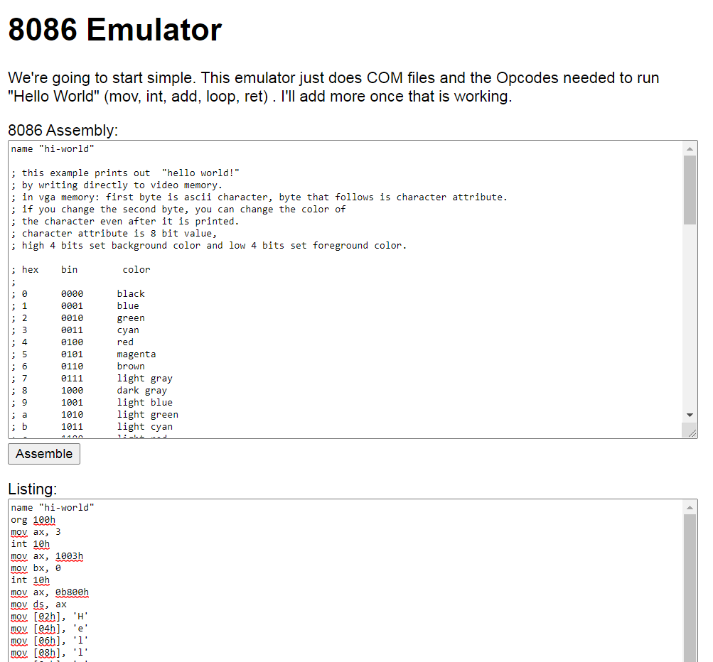

# 8086 Emulator

## About

A personal project to help me learn about emulators, assembly, C, reverse engineering, CPU architecture, and how computers work at a low level.

I chose a 16-bit CPU architecture because 1) in theory it should be simpler than modern architectures, and 2) I have a personal goal of reverse engineering some of my favorite DOS games.

There is a pretty big learning curve on this stuff. I've decided to shrink the project to assembling a Hello World.asm script into a .com file, and then step debugging that. Once that is working, I will add more features.

## Screenshot

